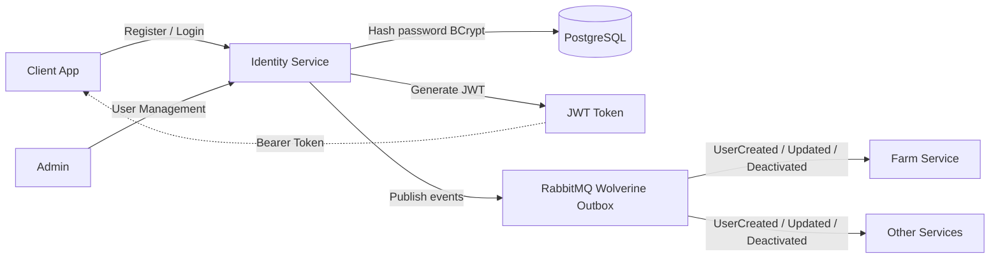
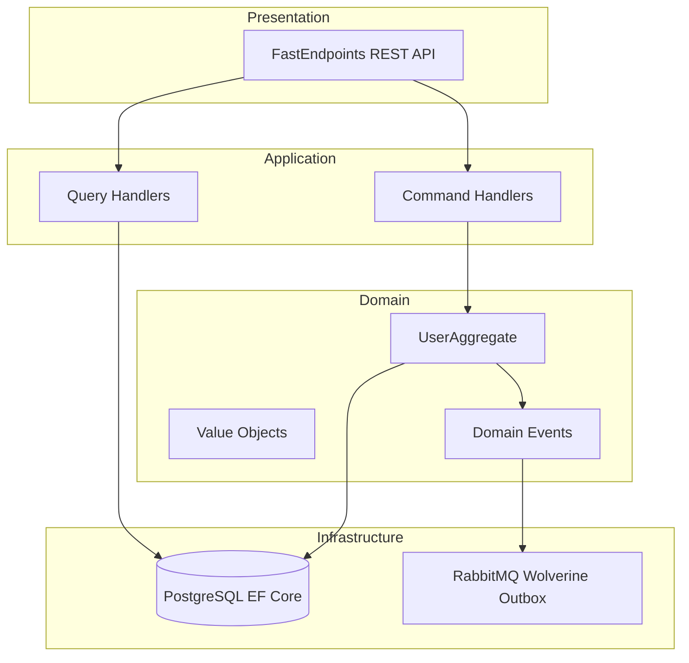
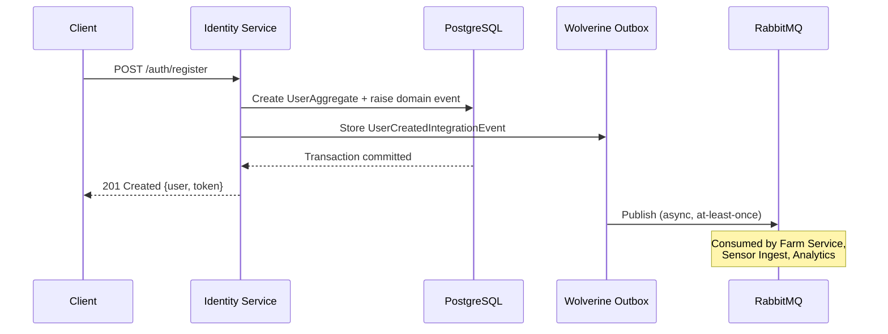

# 🔐 TC Agro Identity Service 🌾

   -green?style=flat-square&logo=codecov) 

> **Authentication & Authorization Microservice** for the TC Agro Solutions agricultural monitoring platform — JWT-based security, role-based access control, and event-driven user lifecycle.

---

## 📋 Table of Contents

- [Overview](#-overview)
- [Architecture](#-architecture)
- [Technologies](#-technologies)
- [Prerequisites](#-prerequisites)
- [Quick Start](#-quick-start)
- [Configuration](#-configuration)
- [Running](#-running)
- [Key Endpoints](#-key-endpoints)
- [Messaging & Integration Events](#-messaging--integration-events)
- [Health Checks](#-health-checks)
- [Observability](#-observability)
- [Security](#-security)
- [Testing](#-testing)
- [Project Structure](#-project-structure)
- [Domain-Driven Design](#-domain-driven-design)
- [License](#-license)

---

## 🎯 Overview

**TC Agro Identity Service** handles authentication, authorization, and user management across the TC Agro ecosystem. It:

- ✅ **Authenticates users** via JWT tokens with BCrypt password hashing
- ✅ **Authorizes access** with role-based control (Admin, Producer, Sensor)
- ✅ **Manages user lifecycle** — registration, update, deactivation, password change
- ✅ **Publishes integration events** so other services stay in sync with user changes
- ✅ **Ensures reliability** with Wolverine Transactional Outbox Pattern
- ✅ **Observes behavior** with OpenTelemetry, Prometheus, and Serilog

### Processing Flow



---

## 🏗️ Architecture

Clean Architecture with DDD and CQRS:



**Patterns:** Clean Architecture · DDD · CQRS · Outbox Pattern · Repository Pattern · Result Pattern · Hexagonal Architecture

---

## 🛠️ Technologies

| Category | Technology |
|---|---|
| Runtime | .NET 10 / C# 14 |
| API | FastEndpoints 7.2 |
| Security | BCrypt.Net-Next · System.IdentityModel.Tokens.Jwt |
| ORM | Entity Framework Core 10 |
| Database | PostgreSQL 16 |
| Messaging | WolverineFx 5.15 + RabbitMQ 4 |
| Observability | OpenTelemetry · Serilog · Prometheus |
| Validation | FluentValidation 12 · Ardalis.Result |
| Testing | xUnit v3 · FakeItEasy · FastEndpoints.Testing |

---

## 📦 Prerequisites

```bash
dotnet --version   # 10.0.x
docker --version   # 24.0.x or higher
```

**Shared packages** (from `tc-agro-common`): `TC.Agro.Contracts`, `TC.Agro.Messaging`, `TC.Agro.SharedKernel`

---

## 🚀 Quick Start

```bash
git clone https://github.com/rdpresser/tc-agro-identity-service.git
cd tc-agro-identity-service

# Start infrastructure (PostgreSQL, RabbitMQ)
docker compose up -d

# Apply migrations
dotnet ef database update --project src/Adapters/Inbound/TC.Agro.Identity.Service

# Run the service
dotnet run --project src/Adapters/Inbound/TC.Agro.Identity.Service
```

**Verify:**
```bash
curl http://localhost:5001/health
# open http://localhost:5001/swagger
```

---

## ⚙️ Configuration

```json
// appsettings.Development.json (key fields)
{
  "Database": {
    "Postgres": {
      "Host": "localhost",
      "Port": 5432,
      "Database": "tc-agro-identity-db",
      "UserName": "postgres",
      "Password": "postgres"
    }
  },
  "Messaging": {
    "RabbitMQ": {
      "Host": "localhost",
      "Port": 5672,
      "UserName": "guest",
      "Password": "guest"
    }
  },
  "Auth": {
    "Jwt": {
      "Issuer": "tc-agro-identity-service",
      "SecretKey": "your-256-bit-secret-key-change-in-production",
      "Audience": ["tc-agro-identity-service", "tc-agro-farm-service"],
      "ExpirationInMinutes": 480
    }
  }
}
```

**Environment variables (Docker/Kubernetes):**
```bash
export Database__Postgres__Host=postgres
export Database__Postgres__Password=${DB_PASSWORD}
export Messaging__RabbitMQ__Host=rabbitmq
export Auth__Jwt__SecretKey=${JWT_SECRET_KEY}
```

---

## 🏃 Running

```bash
dotnet watch run --project src/Adapters/Inbound/TC.Agro.Identity.Service
```

**Available:**
- API + Swagger: `http://localhost:5001/swagger`
- Health: `http://localhost:5001/health`
- Metrics: `http://localhost:5001/metrics`

---

## 📊 Key Endpoints

### Authentication

| Method | Endpoint | Auth | Description |
|---|---|---|---|
| `POST` | `/auth/register` | No | Register user → JWT token |
| `POST` | `/auth/login` | No | Authenticate → JWT + refresh token |
| `POST` | `/auth/refresh` | Yes | Refresh JWT token |

**Register request:**
```json
{
  "email": "producer@example.com",
  "password": "SecureP@ssw0rd!",
  "name": "João Produtor",
  "username": "joaoprodutor",
  "role": "Producer"
}
```

**Login response:**
```json
{
  "token": "eyJhbGciOiJIUzI1NiIsInR5cCI6IkpXVCJ9...",
  "refreshToken": "7c9e6679-7425-40de-944b-e07fc1f90ae7",
  "expiresIn": 28800,
  "user": { "id": "...", "email": "producer@example.com", "roles": ["Producer"] }
}
```

### User Management

| Method | Endpoint | Auth | Description |
|---|---|---|---|
| `GET` | `/users/{id}` | Yes | Get user profile |
| `PUT` | `/users/{id}` | Yes | Update profile |
| `POST` | `/users/{id}/deactivate` | Yes (Admin) | Soft-delete user |
| `POST` | `/users/{id}/change-password` | Yes | Change password |
| `GET` | `/users` | Yes (Admin) | List all users |

### Roles

| Role | Description |
|---|---|
| `Admin` | Full access — user management, system configuration |
| `Producer` | Farm management, sensor data access, alert management |
| `Sensor` | Ingestion-only — allowed to POST sensor readings |

---

## 📨 Messaging & Integration Events

Events published via **Wolverine Transactional Outbox** to RabbitMQ.

### Published Events

| Event | Trigger | Key Consumers |
|---|---|---|
| `UserCreatedIntegrationEvent` | User registration | Farm Service, Sensor Ingest, Analytics |
| `UserUpdatedIntegrationEvent` | Profile update | Farm Service, Sensor Ingest, Analytics |
| `UserDeactivatedIntegrationEvent` | User deactivation | Farm Service, Sensor Ingest, Analytics |

**Event payload example:**
```json
{
  "data": {
    "ownerId": "3fa85f64-5717-4562-b3fc-2c963f66afa6",
    "email": "producer@example.com",
    "name": "João Produtor",
    "username": "joaoprodutor",
    "role": "Producer"
  },
  "metadata": {
    "eventId": "7c9e6679-7425-40de-944b-e07fc1f90ae7",
    "occurredOn": "2026-02-27T10:30:00Z",
    "correlationId": "request-correlation-id",
    "source": "Identity.Service.CreateUserCommandHandler"
  }
}
```

### Event Flow



---

## 🏥 Health Checks

| Endpoint | Purpose | Checks |
|---|---|---|
| `/health` | Overall health | PostgreSQL, Memory |
| `/ready` | Kubernetes readiness | PostgreSQL (critical) |
| `/live` | Kubernetes liveness | Memory |

---

## 📊 Observability

- **Metrics:** `/metrics` in Prometheus exposition format — HTTP requests, DB queries, Wolverine messages, login/registration counters
- **Tracing:** OTLP export, W3C Trace Context propagation, `X-Correlation-Id` header in all requests
- **Logging:** Serilog structured logs enriched with TraceId, UserId, CorrelationId — exported to console + OTLP Collector → Grafana Loki

**Local access:**
- Grafana: `http://localhost:3000` (admin/admin)
- Prometheus: `http://localhost:9090`

---

## 🔐 Security

- **Password hashing:** BCrypt, work factor 12
- **JWT:** HS256, 8h expiration, configurable secret (min 256-bit)
- **Validation:** FluentValidation on all endpoints — email format, password complexity (min 8 chars, uppercase, lowercase, digit, special char)
- **SQL injection:** prevented via EF Core parameterized queries
- **Authorization:** role-based policies enforced per endpoint

---

## 🧪 Testing

```bash
dotnet test
dotnet test --filter "FullyQualifiedName~Domain"
dotnet test --filter "FullyQualifiedName~Application"
dotnet test --collect:"XPlat Code Coverage"
```

**Test structure:**
```
test/TC.Agro.Identity.Tests/
├── Domain/
│   ├── Aggregates/       # UserAggregateTests
│   └── ValueObjects/     # Email, Password, Role
├── Application/
│   └── UseCases/         # CreateUser, UpdateUser, DeactivateUser, Login, GetUser
└── Infrastructure/
    └── Repositories/     # integration tests
```

---

## 📂 Project Structure

```
tc-agro-identity-service/
├── src/
│   ├── Core/
│   │   ├── TC.Agro.Identity.Domain/
│   │   │   ├── Aggregates/
│   │   │   │   └── UserAggregate.cs            # aggregate root + domain events
│   │   │   └── ValueObjects/
│   │   │       ├── Email.cs
│   │   │       ├── Password.cs
│   │   │       └── Role.cs                     # Admin, Producer, Sensor
│   │   │
│   │   └── TC.Agro.Identity.Application/
│   │       ├── UseCases/
│   │       │   ├── CreateUser/
│   │       │   ├── UpdateUser/
│   │       │   ├── DeactivateUser/
│   │       │   ├── ChangePassword/
│   │       │   ├── LoginUser/
│   │       │   ├── RefreshToken/
│   │       │   ├── GetUser/
│   │       │   └── GetUserList/
│   │       └── Abstractions/Ports/
│   │           ├── IUserAggregateRepository.cs
│   │           ├── IUserReadStore.cs
│   │           └── IPasswordHasher.cs
│   │
│   └── Adapters/
│       ├── Inbound/TC.Agro.Identity.Service/
│       │   ├── Endpoints/
│       │   │   ├── Auth/                       # Register, Login, Refresh, ChangePassword
│       │   │   └── User/                       # GetUser, UpdateUser, Deactivate, GetList
│       │   ├── Services/
│       │   │   ├── JwtTokenService.cs
│       │   │   └── PasswordHasherService.cs
│       │   ├── Middleware/TelemetryMiddleware.cs
│       │   └── Program.cs
│       │
│       └── Outbound/TC.Agro.Identity.Infrastructure/
│           ├── ApplicationDbContext.cs
│           ├── Repositories/
│           │   ├── UserAggregateRepository.cs
│           │   └── UserReadStore.cs
│           └── Migrations/
│
└── test/TC.Agro.Identity.Tests/
```

---

## 🎨 Domain-Driven Design

### UserAggregate

```csharp
// Create user
var result = UserAggregate.Create(
    email: Email.Create("producer@example.com"),
    password: Password.Create("SecureP@ssw0rd!"),
    name: "João Produtor",
    username: "joaoprodutor",
    role: Role.Producer);
// raises UserCreatedDomainEvent → mapped to UserCreatedIntegrationEvent

// State transitions
user.UpdateInfo(name, email, username);    // → UserUpdatedDomainEvent
user.Deactivate();                         // → UserDeactivatedDomainEvent
user.ChangePassword(oldPassword, newPassword);
```

### Value Objects

**Email** — RFC 5322 validation, max 255 chars  
**Password** — min 8 chars, uppercase + lowercase + digit + special char, stored as BCrypt hash  
**Role** — `Admin` | `Producer` | `Sensor`

---

## 🏷️ License

MIT License — see [LICENSE](LICENSE) for details.

> Part of TC Agro Solutions — Hackathon 8NETT · FIAP Postgraduate · Phase 5
