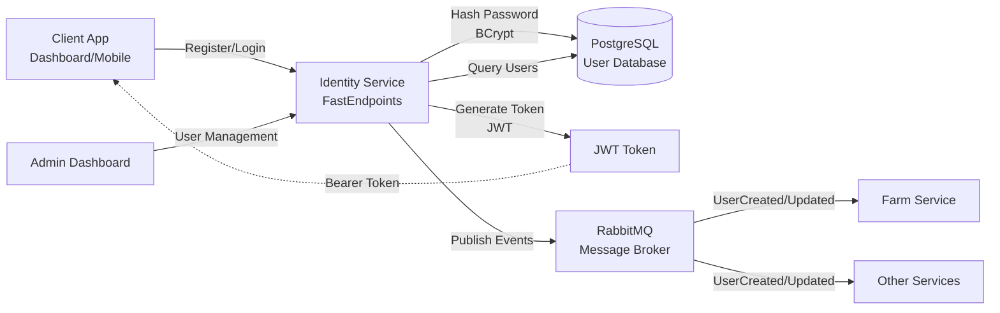
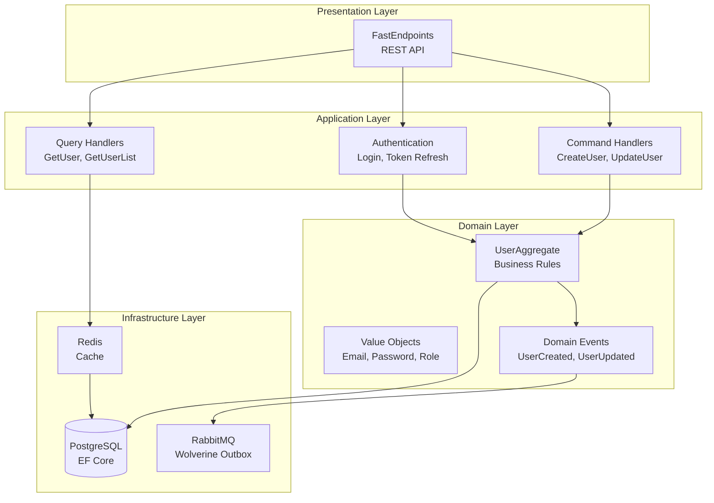
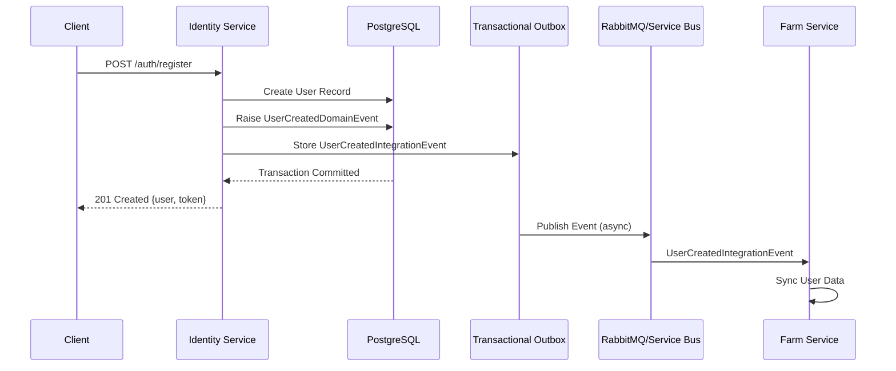

# 🔐 TC Agro Identity Service 🌾

   -green?style=flat-square&logo=codecov) 

> **Authentication & Authorization Microservice** for the TC Agro Solutions agricultural monitoring platform with JWT-based security and event-driven architecture.

---

## 📋 Table of Contents

- [Overview](#-overview)
- [Architecture](#-architecture)
- [Technologies](#-technologies)
- [Prerequisites](#-prerequisites)
- [Quick Start](#-quick-start)
- [Configuration](#-configuration)
- [Running](#-running)
- [Key Endpoints](#-key-endpoints)
- [Messaging & Integration Events](#-messaging--integration-events)
- [Health Checks](#-health-checks)
- [Observability](#-observability)
- [Security](#-security)
- [Testing](#-testing)
- [Project Structure](#-project-structure)
- [Domain-Driven Design](#-domain-driven-design)
- [Documentation](#-documentation)
- [License](#-license)

---

## 🎯 Overview

**TC Agro Identity Service** is a specialized microservice for authentication, authorization, and user management in the TC Agro Solutions ecosystem. It:

- ✅ **Authenticates users** via JWT tokens with secure password hashing (BCrypt)
- ✅ **Authorizes access** with role-based access control (Admin, Farmer, Viewer)
- ✅ **Manages user lifecycle** (registration, update, deactivation)
- ✅ **Publishes integration events** to notify other services about user changes
- ✅ **Provides REST API** for user management operations
- ✅ **Persists data** in PostgreSQL via Entity Framework Core
- ✅ **Ensures reliability** with Wolverine Transactional Outbox Pattern
- ✅ **Monitors health** with comprehensive health checks
- ✅ **Observes behavior** with OpenTelemetry, Prometheus, and Serilog

### Processing Flow



---

## 🏗️ Architecture

This project implements **Clean Architecture** with **Domain-Driven Design** (DDD) and **CQRS**:



### Architectural Patterns

- ✅ **Clean Architecture** - Separation of concerns in layers (Core, Application, Infrastructure, Presentation)
- ✅ **Domain-Driven Design (DDD)** - Rich domain modeling with Aggregates (UserAggregate) and Value Objects (Email, Role)
- ✅ **CQRS** - Separation of commands (write operations) and queries (read operations)
- ✅ **Event-Driven Architecture** - Asynchronous integration via published events (UserCreated, UserUpdated, UserDeactivated)
- ✅ **Outbox Pattern** - Transactional consistency of messages (Wolverine Transactional Outbox)
- ✅ **Repository Pattern** - Persistence abstraction via interfaces
- ✅ **Result Pattern** - Error handling without exceptions (Ardalis.Result)
- ✅ **Hexagonal Architecture** - Adapters (Inbound/Outbound) isolate core logic

---

## 🛠️ Technologies

### Core

- **.NET 10.0** - Modern, high-performance framework
- **C# 14.0** - Programming language with advanced features

### API & Web

- **FastEndpoints 7.2** - Minimalist, high-performance API framework (REPR pattern)
- **Swagger/OpenAPI** - Automatic API documentation
- **ASP.NET Core** - Web hosting and middleware

### Security

- **BCrypt.Net-Next** - Password hashing with salt (workFactor 12)
- **System.IdentityModel.Tokens.Jwt** - JWT token generation and validation
- **ASP.NET Core Authentication** - JWT Bearer authentication

### Persistence

- **Entity Framework Core 10.0** - Modern ORM for .NET
- **PostgreSQL 16+** - Relational database
- **Npgsql 10.0** - High-performance PostgreSQL driver
- **Redis** - Cache for user sessions and tokens (optional)

### Message Broker

- **WolverineFx 5.15** - Messaging framework with integrated Outbox Pattern
- **RabbitMQ 4.0** (Local Development) - Enterprise-grade message broker

### Observability

- **Serilog 4.1** - Structured logging
- **OpenTelemetry** - Distributed tracing and metrics
- **Prometheus** - Metrics exposition format
- **Grafana Loki** - Log aggregation
- **Azure Application Insights** (Production) - APM

### Validation & Error Handling

- **FluentValidation 12.1** - Input validation for all endpoints
- **Ardalis.Result 10.1** - Result Pattern for error handling

### Testing

- **xUnit v3** - Unit testing framework
- **FakeItEasy / Moq** - Mocking framework
- **FastEndpoints.Testing** - Endpoint testing helpers

---

## 📦 Prerequisites

### Required Software

```bash
# .NET SDK 10.0 or higher
dotnet --version
# Expected output: 10.0.x

# Docker (to run dependencies locally)
docker --version
# Expected output: 24.0.x or higher

# Docker Compose (optional for local development)
docker-compose --version
# Expected output: 2.x or higher
```

### External Dependencies

#### Production (Cloud)
- **PostgreSQL** - Managed database (Azure Database for PostgreSQL, AWS RDS)
- **RabbitMQ / Azure Service Bus** - Managed message broker
- **Redis** (Optional) - Managed cache (Azure Redis Cache)

#### Local Development
- **PostgreSQL 16+** (via Docker or local installation)
- **RabbitMQ 4.0+** (via Docker or local installation)
- **Redis 7.0+** (via Docker or local installation)

### Shared Packages

This project depends on shared packages from the `tc-agro-common` repository:
- `TC.Agro.Contracts` - Integration events and DTOs
- `TC.Agro.Messaging` - Messaging configurations
- `TC.Agro.SharedKernel` - Base classes (Aggregate, Repository, Value Objects)

---

## 🚀 Quick Start

### Option 1: Docker Compose (Recommended)

```bash
# Clone the repository
git clone https://github.com/rdpresser/tc-agro-identity-service.git
cd tc-agro-identity-service

# Start all dependencies (PostgreSQL, Redis, RabbitMQ)
docker compose up -d

# Apply database migrations
dotnet ef database update --project src/Adapters/Inbound/TC.Agro.Identity.Service

# Run the service
dotnet run --project src/Adapters/Inbound/TC.Agro.Identity.Service
```

**Verify it's working:**

```bash
# Health check
curl http://localhost:5001/health

# Swagger UI
open http://localhost:5001/swagger  # Mac/Linux
start http://localhost:5001/swagger  # Windows
```

**Estimated time:** 3-4 minutes

### Option 2: Manual Setup

```bash
# 1. Clone the repository
git clone https://github.com/rdpresser/tc-agro-identity-service.git
cd tc-agro-identity-service

# 2. Restore dependencies
dotnet restore

# 3. Start PostgreSQL (example with Docker)
docker run -d \
  --name postgres-identity \
  -e POSTGRES_PASSWORD=postgres \
  -e POSTGRES_DB=tc-agro-identity-db \
  -p 5432:5432 \
  postgres:16-alpine

# 4. Start RabbitMQ (example with Docker)
docker run -d \
  --name rabbitmq-identity \
  -p 5672:5672 \
  -p 15672:15672 \
  rabbitmq:4-management-alpine

# 5. Apply migrations
dotnet ef database update --project src/Adapters/Inbound/TC.Agro.Identity.Service

# 6. Run the application
dotnet run --project src/Adapters/Inbound/TC.Agro.Identity.Service
```

---

## ⚙️ Configuration

### Configuration Structure

The project uses ASP.NET Core's hierarchical configuration pattern:

```
appsettings.json (base - minimal config)
├── appsettings.Development.json (local development)
├── appsettings.Production.json (production/cloud)
└── Environment Variables (Docker/Kubernetes - override)
```

### appsettings.Development.json (Example)

```json
{
  "Database": {
    "Postgres": {
      "Host": "localhost",
      "Port": 5432,
      "Database": "tc-agro-identity-db",
      "UserName": "postgres",
      "Password": "postgres",
      "ConnectionTimeout": 30,
      "MaxPoolSize": 20
    }
  },
  "Cache": {
    "Redis": {
      "Host": "localhost",
      "Port": 6379,
      "Password": ""
    }
  },
  "Messaging": {
    "RabbitMQ": {
      "Host": "localhost",
      "Port": 5672,
      "VirtualHost": "/",
      "Exchange": "identity.events",
      "UserName": "guest",
      "Password": "guest",
      "AutoProvision": true
    }
  },
  "Auth": {
    "Jwt": {
      "Issuer": "tc-agro-identity-service",
      "SecretKey": "your-256-bit-secret-key-change-in-production",
      "Audience": ["tc-agro-identity-service", "tc-agro-farm-service"],
      "ExpirationInMinutes": 480
    }
  },
  "Services": {
    "Identity": {
      "HttpPort": 5001
    }
  }
}
```

### appsettings.Production.json (Cloud Example)

```json
{
  "Database": {
    "Postgres": {
      "Host": "your-db-server.postgres.database.azure.com",
      "Port": 5432,
      "Database": "tc-agro-identity-db",
      "UserName": "postgres@your-server",
      "Password": "${DB_PASSWORD}",
      "SslMode": "Require"
    }
  },
  "Messaging": {
    "AzureServiceBus": {
      "ConnectionString": "${AZURE_SERVICE_BUS_CONNECTION_STRING}",
      "TopicName": "identity-events"
    }
  },
  "Auth": {
    "Jwt": {
      "SecretKey": "${JWT_SECRET_KEY}"
    }
  },
  "ApplicationInsights": {
    "ConnectionString": "${APPLICATIONINSIGHTS_CONNECTION_STRING}"
  }
}
```

### Environment Variables (Docker/Kubernetes)

```bash
# Database
export Database__Postgres__Host=postgres
export Database__Postgres__Password=${DB_PASSWORD}

# RabbitMQ / Azure Service Bus
export Messaging__RabbitMQ__Host=rabbitmq
export Messaging__RabbitMQ__Password=${RABBITMQ_PASSWORD}

# JWT Secret
export Auth__Jwt__SecretKey=${JWT_SECRET_KEY}

# Observability
export ApplicationInsights__ConnectionString=${APPINSIGHTS_CONN_STRING}

# OpenTelemetry
export Telemetry__Grafana__Agent__Host=otel-collector
export Telemetry__Grafana__Agent__Enabled=true
```

---

## 🏃 Running

### Local Development

```bash
# Run with hot reload (recommended)
dotnet watch run --project src/Adapters/Inbound/TC.Agro.Identity.Service

# Or without hot reload
dotnet run --project src/Adapters/Inbound/TC.Agro.Identity.Service
```

**Expected output:**
```
info: Microsoft.Hosting.Lifetime[14]
      Now listening on: http://localhost:5001
info: WolverineFx[0]
      Wolverine messaging service is starting
info: Wolverine.RabbitMQ[0]
      Connected to RabbitMQ at localhost:5672
```

**Available endpoints:**
- API: `http://localhost:5001`
- Swagger UI: `http://localhost:5001/swagger`
- Health Check: `http://localhost:5001/health`
- Metrics: `http://localhost:5001/metrics`

### Production (Build & Publish)

```bash
# Optimized build
dotnet build -c Release

# Publish artifacts
dotnet publish -c Release -o ./publish

# Run
cd publish
dotnet TC.Agro.Identity.Service.dll
```

### Docker

#### Build Image

```bash
# From repository root
docker build -t tc-agro-identity-service:latest \
  -f src/Adapters/Inbound/TC.Agro.Identity.Service/Dockerfile .
```

#### Run Container

```bash
docker run -d \
  --name identity-service \
  -p 5001:8080 \
  -e Database__Postgres__Host=postgres \
  -e Database__Postgres__Password=postgres \
  -e Messaging__RabbitMQ__Host=rabbitmq \
  --network tc-agro-network \
  tc-agro-identity-service:latest
```

### Docker Compose

```bash
# Start entire stack (app + dependencies)
docker-compose up -d

# View logs
docker-compose logs -f identity-service

# Stop stack
docker-compose down
```

---

## 📊 Key Endpoints

### Authentication Endpoints

| Endpoint          | Method | Auth | Description              | Request Body                              | Response                     |
| ----------------- | ------ | ---- | ------------------------ | ----------------------------------------- | ---------------------------- |
| `/auth/register`  | POST   | No   | User registration        | `{email, password, name, username, role}` | `{id, email, name, token}`   |
| `/auth/login`     | POST   | No   | User authentication      | `{email, password}`                       | `{token, refreshToken, ...}` |
| `/auth/refresh`   | POST   | Yes  | Refresh JWT token        | `{refreshToken}`                          | `{token, refreshToken}`      |

### User Management Endpoints

| Endpoint                     | Method | Auth | Description                | Request Body              | Response                     |
| ---------------------------- | ------ | ---- | -------------------------- | ------------------------- | ---------------------------- |
| `/users/{id}`                | GET    | Yes  | Get user profile           | -                         | `{id, email, name, roles}`   |
| `/users/{id}`                | PUT    | Yes  | Update user profile        | `{name, email, username}` | `{id, email, name}`          |
| `/users/{id}/deactivate`     | POST   | Yes  | Deactivate user (soft delete) | -                   | `{success, message}`         |
| `/users/{id}/change-password`| POST   | Yes  | Change user password       | `{oldPassword, newPassword}` | `{success, message}`      |
| `/users`                     | GET    | Yes  | List users (Admin only)    | -                         | `{users[], total}`           |
| `/users/email/{email}`       | GET    | Yes  | Get user by email          | -                         | `{id, email, name}`          |

### Administrative Endpoints

| Endpoint                  | Method | Auth       | Description                      |
| ------------------------- | ------ | ---------- | -------------------------------- |
| `/health`                 | GET    | No         | Overall application health       |
| `/ready`                  | GET    | No         | Readiness probe (Kubernetes)     |
| `/live`                   | GET    | No         | Liveness probe (Kubernetes)      |
| `/metrics`                | GET    | No         | Prometheus metrics               |
| `/swagger`                | GET    | No         | OpenAPI/Swagger documentation    |

### Example Requests & Responses

#### **POST `/auth/register`** - User Registration

**Request:**
```json
{
  "email": "farmer@example.com",
  "password": "SecureP@ssw0rd!",
  "name": "John Farmer",
  "username": "johnfarmer",
  "role": "Farmer"
}
```

**Response (201 Created):**
```json
{
  "id": "3fa85f64-5717-4562-b3fc-2c963f66afa6",
  "email": "farmer@example.com",
  "name": "John Farmer",
  "username": "johnfarmer",
  "role": "Farmer",
  "token": "eyJhbGciOiJIUzI1NiIsInR5cCI6IkpXVCJ9...",
  "createdAt": "2026-01-15T10:30:00Z"
}
```

#### **POST `/auth/login`** - User Login

**Request:**
```json
{
  "email": "farmer@example.com",
  "password": "SecureP@ssw0rd!"
}
```

**Response (200 OK):**
```json
{
  "token": "eyJhbGciOiJIUzI1NiIsInR5cCI6IkpXVCJ9...",
  "refreshToken": "7c9e6679-7425-40de-944b-e07fc1f90ae7",
  "expiresIn": 28800,
  "user": {
    "id": "3fa85f64-5717-4562-b3fc-2c963f66afa6",
    "email": "farmer@example.com",
    "name": "John Farmer",
    "roles": ["Farmer"]
  }
}
```

---

## 📨 Messaging & Integration Events

The Identity Service publishes integration events to notify other services about user lifecycle changes. These events are published using **Wolverine** with **Transactional Outbox** pattern to ensure reliability.

### Published Events

| Event                              | Routing Key                  | Trigger                        | Payload                                  |
| ---------------------------------- | ---------------------------- | ------------------------------ | ---------------------------------------- |
| `UserCreatedIntegrationEvent`      | `identity.user.created`      | User registration              | UserId, Email, Name, Username, Roles     |
| `UserUpdatedIntegrationEvent`      | `identity.user.updated`      | User profile update            | UserId, Email, Name, Username            |
| `UserDeactivatedIntegrationEvent`  | `identity.user.deactivated`  | User deactivation (soft delete)| UserId, Email, DeactivatedAt, DeactivatedBy |

### Event Flow



### Message Bus Configuration

- **Local Development:** RabbitMQ (Topic Exchange: `identity.events-exchange`)
- **Production:** Azure Service Bus
- **Reliability:** Transactional Outbox + Durable Queues
- **Routing:** Convention-based routing keys (`identity.user.*`)

### Consumers

These events are consumed by:

- **Farm Service** - Synchronizes user information for farm ownership validation
- **Other services** - May consume user events for audit logs, analytics, etc.

### Example Event Payload

```json
{
  "data": {
    "ownerId": "3fa85f64-5717-4562-b3fc-2c963f66afa6",
    "email": "farmer@example.com",
    "name": "John Farmer",
    "username": "johnfarmer",
    "role": "Farmer"
  },
  "metadata": {
    "eventId": "7c9e6679-7425-40de-944b-e07fc1f90ae7",
    "occurredOn": "2026-01-15T10:30:00Z",
    "aggregateId": "3fa85f64-5717-4562-b3fc-2c963f66afa6",
    "userId": "admin-user-id",
    "correlationId": "request-correlation-id",
    "source": "Identity.Service.CreateUserCommandHandler.UserCreatedIntegrationEvent"
  }
}
```

---

## 🏥 Health Checks

The service provides comprehensive health checks for monitoring and orchestration.

### Endpoints

| Endpoint   | Purpose                          | Checks                                    |
| ---------- | -------------------------------- | ----------------------------------------- |
| `/health`  | Overall application health       | All checks (PostgreSQL, Redis, Memory)    |
| `/ready`   | Readiness probe (Kubernetes)     | PostgreSQL, Redis (critical dependencies) |
| `/live`    | Liveness probe (Kubernetes)      | Memory, Custom metrics                    |

### Health Check Details

- **PostgreSQL** - Database connectivity and query execution
- **Redis** - Cache availability and response time
- **Memory** - System memory usage (Degraded if > 1GB)
- **Custom Metrics** - Telemetry system health

### Example Response

```json
{
  "status": "Healthy",
  "totalDuration": "00:00:00.0123456",
  "entries": {
    "PostgreSQL": {
      "status": "Healthy",
      "description": "Connection successful",
      "duration": "00:00:00.0100000"
    },
    "Redis": {
      "status": "Healthy",
      "description": "Cache responding",
      "duration": "00:00:00.0020000"
    },
    "Memory": {
      "status": "Healthy",
      "description": "Memory usage: 256 MB",
      "duration": "00:00:00.0003456"
    }
  }
}
```

---

## 📊 Observability

The Identity Service is fully instrumented with OpenTelemetry for metrics, traces, and logs.

### Telemetry Stack

- **OpenTelemetry** - Unified observability framework
- **Prometheus** - Metrics collection and storage
- **Grafana Loki** - Log aggregation
- **Grafana Tempo** - Distributed tracing
- **OpenTelemetry Collector** - Centralized telemetry processing

### Metrics Endpoint

- **URL:** `/metrics`
- **Format:** Prometheus exposition format
- **Exported Metrics:**
  - ASP.NET Core (HTTP requests, response times)
  - Runtime (GC, thread pool, exceptions)
  - PostgreSQL (connections, queries)
  - Redis (cache hits, misses)
  - Wolverine (messages published, processed)
  - Custom Identity metrics (registrations, logins, token generation)

### Distributed Tracing

- **Protocol:** OTLP (OpenTelemetry Protocol)
- **Instrumentation:**
  - HTTP requests (inbound/outbound)
  - Database queries (EF Core + Npgsql)
  - Message publishing (Wolverine)
  - Custom spans for business operations
- **Trace Context:** Automatic propagation via W3C Trace Context headers
- **Correlation ID:** Custom header `X-Correlation-Id` for request tracing

### Structured Logging

- **Library:** Serilog
- **Outputs:**
  - Console (Compact JSON format)
  - OpenTelemetry Collector → Grafana Loki
- **Enrichment:**
  - Trace ID / Span ID (automatic correlation)
  - User ID, Username, Roles
  - Correlation ID
  - Environment, Service Name, Instance ID

### Observability Configuration

```json
{
  "Telemetry": {
    "Grafana": {
      "Agent": {
        "Host": "otel-collector",
        "OtlpGrpcPort": 4317,
        "OtlpHttpPort": 4318,
        "Enabled": true
      }
    }
  }
}
```

### Accessing Observability Tools (Local Development)

- **Grafana:** http://localhost:3000 (default credentials: admin/admin)
- **Prometheus:** http://localhost:9090
- **RabbitMQ Management:** http://localhost:15672 (guest/guest)

---

## 🔐 Security

### Password Security

- **Hashing Algorithm:** BCrypt with salt
- **Work Factor:** 12 (2^12 = 4096 rounds)
- **Storage:** Hashed passwords only, never plain text
- **Validation:** Minimum 8 characters, uppercase, lowercase, digit, special character

### JWT Token Security

- **Algorithm:** HS256 (HMAC with SHA-256)
- **Expiration:** 8 hours (configurable)
- **Claims:** UserId, Email, Name, Roles
- **Secret Key:** 256-bit minimum (stored in secure configuration)
- **Refresh Token:** Opaque GUID stored in database

### Authorization

- **Roles:** Admin, Farmer, Viewer
- **Policies:** Role-based policies enforced on endpoints
- **Admin Actions:** User management, deactivation (Admin only)
- **Self-Service:** Users can update their own profile and change password

### Security Headers

- **X-Content-Type-Options:** nosniff
- **X-Frame-Options:** DENY
- **X-XSS-Protection:** 1; mode=block
- **Strict-Transport-Security:** max-age=31536000; includeSubDomains

### Input Validation

- **FluentValidation:** All endpoints validate input
- **Email Format:** RFC 5322 compliant
- **SQL Injection:** Prevented via parameterized queries (EF Core)
- **XSS:** Output encoding in responses

---

## 🧪 Testing

### Run All Tests

```bash
# Complete suite
dotnet test

# With detailed output
dotnet test --verbosity normal

# Only specific test category
dotnet test --filter "FullyQualifiedName~Domain"
dotnet test --filter "FullyQualifiedName~Application"
```

### Run with Code Coverage

```bash
# Collect coverage
dotnet test --collect:"XPlat Code Coverage"

# Generate HTML report (requires ReportGenerator)
dotnet tool install -g dotnet-reportgenerator-globaltool

reportgenerator \
  -reports:"**/coverage.cobertura.xml" \
  -targetdir:"coveragereport" \
  -reporttypes:Html

# Open report
start coveragereport/index.html  # Windows
open coveragereport/index.html   # Mac/Linux
```

### Test Structure

```
test/TC.Agro.Identity.Tests/
├── Domain/
│   ├── Aggregates/
│   │   └── UserAggregateTests.cs              # Aggregate root tests
│   ├── ValueObjects/
│   │   ├── EmailTests.cs
│   │   ├── PasswordTests.cs
│   │   └── RoleTests.cs
│   └── DomainEvents/
│       ├── UserCreatedDomainEventTests.cs
│       └── UserUpdatedDomainEventTests.cs
├── Application/
│   ├── UseCases/
│   │   ├── CreateUser/
│   │   │   └── CreateUserCommandHandlerTests.cs
│   │   ├── UpdateUser/
│   │   │   └── UpdateUserCommandHandlerTests.cs
│   │   ├── DeactivateUser/
│   │   │   └── DeactivateUserCommandHandlerTests.cs
│   │   ├── LoginUser/
│   │   │   └── LoginUserCommandHandlerTests.cs
│   │   └── GetUser/
│   │       └── GetUserQueryHandlerTests.cs
│   └── Mappers/
│       └── IntegrationEventMapperTests.cs
└── Infrastructure/
    └── Repositories/
        └── UserAggregateRepositoryTests.cs (integration tests)
```

### Tests in Watch Mode

```bash
# Run tests automatically on file save
dotnet watch test --project test/TC.Agro.Identity.Tests
```

### Integration Tests

For complete end-to-end tests with PostgreSQL and RabbitMQ:

```bash
# Requires Docker running with test containers
dotnet test --filter "Category=Integration"
```

---

## 📂 Project Structure

```
tc-agro-identity-service/
├── src/
│   ├── Core/                                           # Domain + Application Logic
│   │   ├── TC.Agro.Identity.Domain/
│   │   │   ├── Aggregates/
│   │   │   │   ├── UserAggregate.cs                    # 🎯 Aggregate Root with business rules
│   │   │   │   └── IdentityDomainErrors.cs             # Domain errors
│   │   │   ├── ValueObjects/
│   │   │   │   ├── Email.cs                            # Email value object with validation
│   │   │   │   ├── Password.cs                         # Password value object with rules
│   │   │   │   └── Role.cs                             # Role enumeration (Admin, Farmer, Viewer)
│   │   │   ├── DomainEvents/
│   │   │   │   ├── UserCreatedDomainEvent.cs
│   │   │   │   ├── UserUpdatedDomainEvent.cs
│   │   │   │   └── UserDeactivatedDomainEvent.cs
│   │   │   └── Abstractions/
│   │   │       └── DomainError.cs                      # Base error class
│   │   │
│   │   └── TC.Agro.Identity.Application/
│   │       ├── UseCases/                               # 🎯 CQRS Handlers
│   │       │   ├── CreateUser/
│   │       │   │   ├── CreateUserCommand.cs
│   │       │   │   ├── CreateUserCommandHandler.cs
│   │       │   │   ├── CreateUserCommandValidator.cs
│   │       │   │   └── CreateUserMapper.cs
│   │       │   ├── UpdateUser/
│   │       │   │   ├── UpdateUserCommand.cs
│   │       │   │   └── UpdateUserCommandHandler.cs
│   │       │   ├── DeactivateUser/
│   │       │   │   ├── DeactivateUserCommand.cs
│   │       │   │   └── DeactivateUserCommandHandler.cs
│   │       │   ├── LoginUser/
│   │       │   │   ├── LoginUserCommand.cs
│   │       │   │   └── LoginUserCommandHandler.cs
│   │       │   ├── GetUser/
│   │       │   │   ├── GetUserQuery.cs
│   │       │   │   └── GetUserQueryHandler.cs
│   │       │   └── GetUserList/
│   │       │       ├── GetUserListQuery.cs
│   │       │       └── GetUserListQueryHandler.cs
│   │       ├── Abstractions/Ports/
│   │       │   ├── IUserAggregateRepository.cs         # Repository interface
│   │       │   ├── IUserReadStore.cs                   # Query interface
│   │       │   └── IPasswordHasher.cs                  # Password hashing interface
│   │       └── DependencyInjection.cs
│   │
│   └── Adapters/                                       # Infrastructure & Presentation
│       ├── Inbound/                                    # 🌐 Presentation Layer
│       │   └── TC.Agro.Identity.Service/
│       │       ├── Program.cs                          # Bootstrap + DI Container
│       │       ├── Endpoints/                          # 🚀 FastEndpoints
│       │       │   ├── Auth/
│       │       │   │   ├── CreateUserEndpoint.cs
│       │       │   │   ├── LoginUserEndpoint.cs
│       │       │   │   ├── RefreshTokenEndpoint.cs
│       │       │   │   └── ChangePasswordEndpoint.cs
│       │       │   └── User/
│       │       │       ├── GetUserEndpoint.cs
│       │       │       ├── UpdateUserEndpoint.cs
│       │       │       ├── DeleteUserEndpoint.cs
│       │       │       └── GetUserListEndpoint.cs
│       │       ├── Services/
│       │       │   ├── JwtTokenService.cs              # JWT token generation
│       │       │   └── PasswordHasherService.cs        # BCrypt password hashing
│       │       ├── Middleware/
│       │       │   └── TelemetryMiddleware.cs          # OpenTelemetry middleware
│       │       ├── Extensions/
│       │       │   └── ServiceCollectionExtensions.cs  # DI extensions
│       │       ├── appsettings.json
│       │       ├── appsettings.Development.json
│       │       └── appsettings.Production.json
│       │
│       └── Outbound/                                   # 🗄️ Infrastructure Layer
│           └── TC.Agro.Identity.Infrastructure/
│               ├── Repositories/
│               │   ├── BaseRepository.cs               # Generic repository base
│               │   ├── UserAggregateRepository.cs      # User aggregate repository (EF Core)
│               │   └── UserReadStore.cs                # User read store (queries)
│               ├── Persistence/
│               │   ├── IdentityDbContext.cs            # EF Core DbContext
│               │   └── Configurations/                 # Entity configurations
│               │       └── UserAggregateConfiguration.cs
│               ├── Migrations/                         # EF Core migrations
│               │   └── 20260201_InitialCreate.cs
│               └── DependencyInjection.cs
│
├── test/
│   └── TC.Agro.Identity.Tests/
│       ├── Domain/                                     # Domain tests (pure)
│       ├── Application/                                # Application tests (with mocks)
│       ├── Infrastructure/                             # Integration tests
│       ├── Builders/                                   # Test data builders
│       └── GlobalUsings.cs
│
├── docs/                                               # 📚 Technical documentation
│   ├── ARCHITECTURE.md                                 # Architecture documentation
│   ├── TESTING_GUIDE.md                                # Testing guide
│   └── API_REFERENCE.md                                # API reference
│
├── docker-compose.yml                                  # Local stack (PostgreSQL + RabbitMQ + Redis)
├── Dockerfile                                          # Production container
├── Directory.Packages.props                            # Central Package Management (CPM)
├── .editorconfig                                       # Code style
├── .gitignore
├── README.md                                           # This file
└── LICENSE                                             # MIT License
```

### Layers and Responsibilities

| Layer | Responsibility | Dependencies |
|-------|----------------|--------------|
| **Domain** | Business rules, aggregates, value objects, domain events | None (pure domain) |
| **Application** | Use cases, handlers, interfaces, mappings | Domain |
| **Infrastructure** | Persistence, messaging, caching, external integrations | Application, Domain |
| **Presentation** | REST API, endpoints, request/response DTOs | Application |

---

## 🎨 Domain-Driven Design

### UserAggregate (Aggregate Root)

The **UserAggregate** is the heart of the domain, managing the entire user lifecycle.

```csharp
// Factory method - Creates a new user
var userResult = UserAggregate.Create(
    email: Email.Create("farmer@example.com"),
    password: Password.Create("SecureP@ssw0rd!"),
    name: "John Farmer",
    username: "johnfarmer",
    role: Role.Farmer
);

if (userResult.IsSuccess)
{
    var user = userResult.Value;
    Console.WriteLine($"User created: {user.Id}");
    // Domain event: UserCreatedDomainEvent is raised
}

// State transitions
user.UpdateInfo(name: "John Updated Farmer", email: updatedEmail, username: "johnupdated");
// Domain event: UserUpdatedDomainEvent is raised

user.Deactivate();
// Domain event: UserDeactivatedDomainEvent is raised

user.ChangePassword(oldPassword, newPassword);
// Password validated and updated
```

### Value Objects

#### **Email** - Email Address

```csharp
var emailResult = Email.Create("farmer@example.com");

if (emailResult.IsSuccess)
{
    var email = emailResult.Value;
    Console.WriteLine(email.Value); // farmer@example.com
}
else
{
    // Validation error: Invalid email format
}
```

**Validation Rules:**
- Must be non-empty
- Must match RFC 5322 email format
- Maximum 255 characters

#### **Password** - Password Value Object

```csharp
var passwordResult = Password.Create("SecureP@ssw0rd!");

if (passwordResult.IsSuccess)
{
    var password = passwordResult.Value;
    // Password is hashed with BCrypt (workFactor 12)
}
else
{
    // Validation errors: minimum length, complexity requirements
}
```

**Validation Rules:**
- Minimum 8 characters
- At least 1 uppercase letter
- At least 1 lowercase letter
- At least 1 digit
- At least 1 special character (@$!%*?&#)

#### **Role** - User Roles

```csharp
public static class Role
{
    public static readonly Role Admin = new("Admin");
    public static readonly Role Farmer = new("Farmer");
    public static readonly Role Viewer = new("Viewer");
}
```

**Role Permissions:**
- **Admin** - Full access (user management, system configuration)
- **Farmer** - Farm management, sensor data access
- **Viewer** - Read-only access to dashboards and reports

### Domain Events

Domain events are raised by the aggregate and then mapped to integration events for publishing:

```csharp
// Domain Event (internal to bounded context)
public record UserCreatedDomainEvent(
    Guid UserId,
    string Email,
    string Name,
    string Username,
    string Role
) : BaseDomainEvent;

// Integration Event (published to message broker)
public record UserCreatedIntegrationEvent(
    Guid OwnerId,
    string Name,
    string Email,
    string Username,
    string Role,
    DateTimeOffset OccurredOn
) : BaseIntegrationEvent;
```

---

## 📚 Documentation

- **Copilot Instructions:** [.github/copilot-instructions.md](.github/copilot-instructions.md)
- **Repository:** https://github.com/rdpresser/tc-agro-identity-service
- **Parent Project:** TC Agro Solutions (Hackathon Phase 5 - FIAP 8NETT)
- **Common Packages:** https://github.com/rdpresser/tc-agro-common

---

## 🏷️ License

MIT License

---

> Part of TC Agro Solutions - Agricultural monitoring platform with IoT, sensor data processing, and dashboards.
